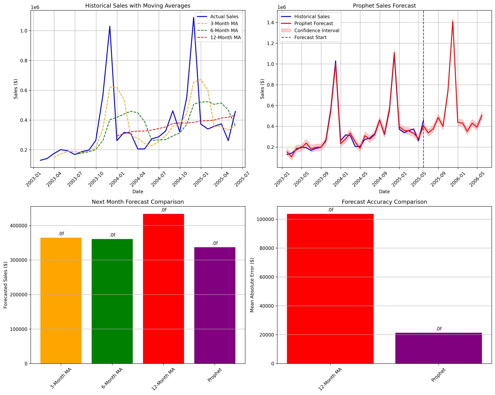
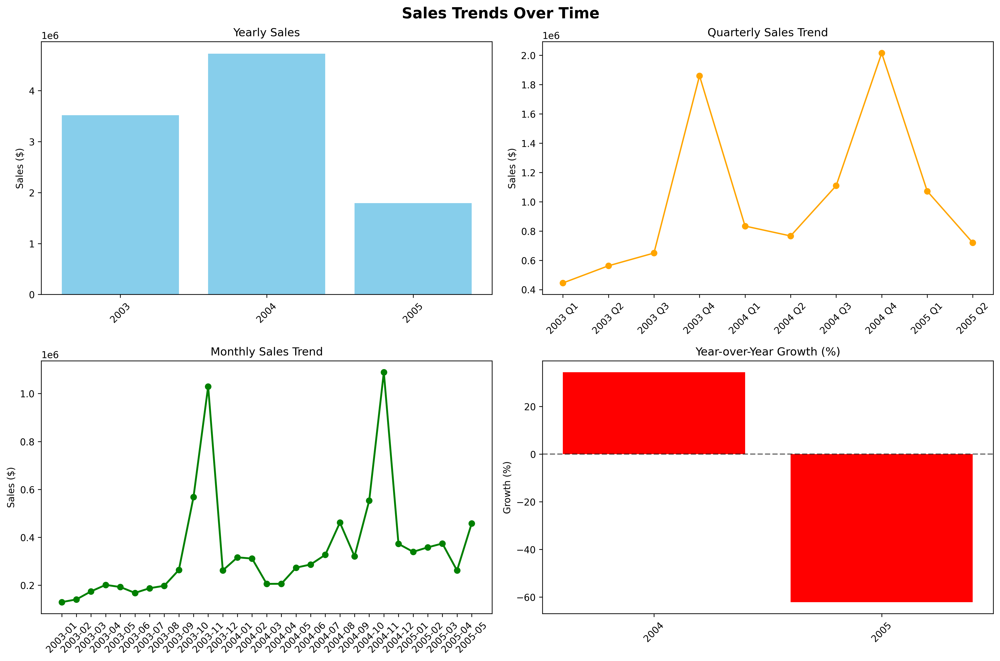
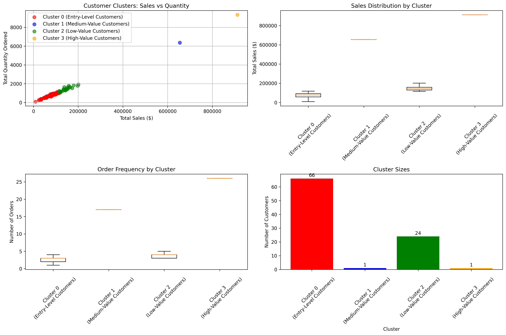
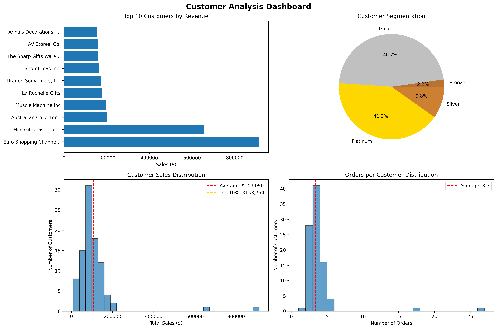
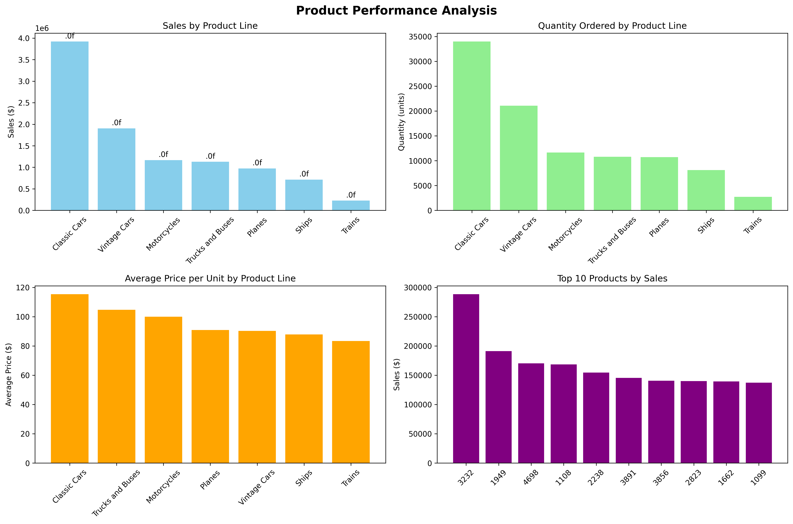
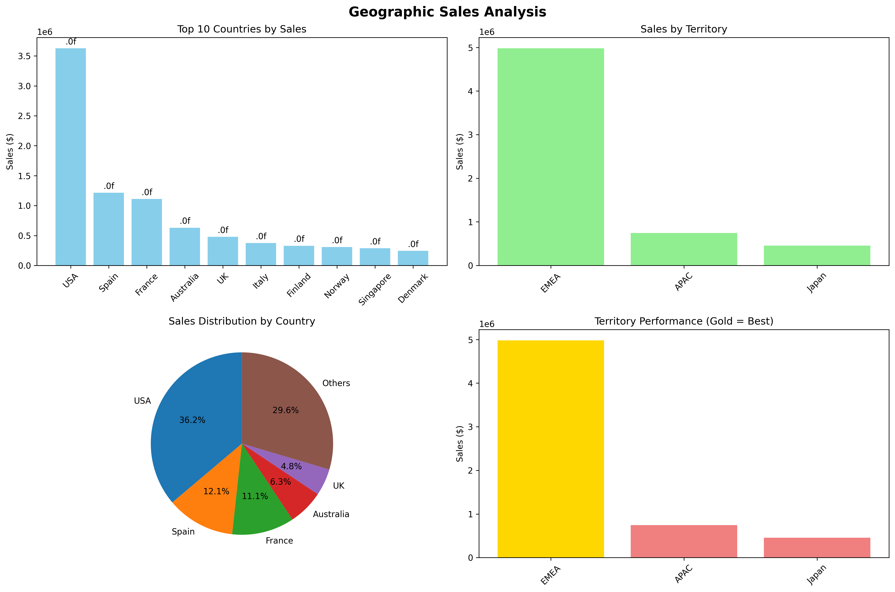
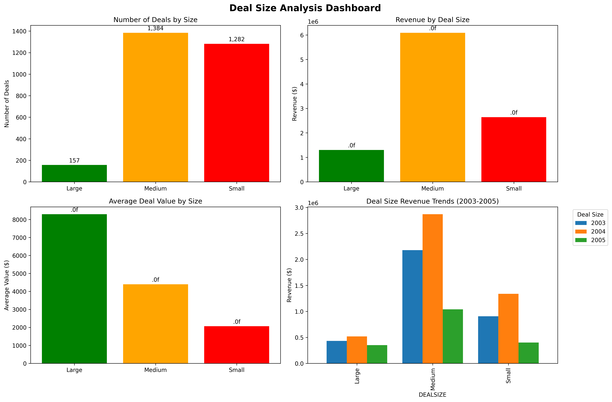

# 🛒 Retail Sales Analytics & Forecasting

A full-stack business analytics project covering sales trend analysis, customer segmentation, product performance, geographic breakdown, and time-series forecasting on a retail dataset spanning 2003–2005.

**Tools:** Python · pandas · Prophet · scikit-learn (K-Means) · matplotlib · seaborn

---

## 📊 Key Business Findings

| Metric | Value |
|--------|-------|
| Total Revenue Analysed | $10,032,628.85 |
| Total Orders | 307 |
| Unique Customers | 92 |
| Analysis Period | Jan 2003 – May 2005 |

- **Classic Cars** is the top product line, generating **39.1% of total revenue** ($3.9M)
- **USA** is the #1 market at **36.2% of sales**; EMEA accounts for **80.6%** globally
- Revenue peaked in **Q4 2004** ($2.0M) — Q4 is consistently the strongest quarter each year
- Top 10 customers represent **29.5% of total revenue**, led by Euro Shopping Channel ($912K)
- **Medium deals** drive **60.7% of revenue** — a concentration risk worth monitoring

---

## 📈 Sales Trends & Forecasting

Sales grew **+34.3% from 2003 to 2004**, then declined sharply in 2005 (partial year data through May). Q4 is the peak season in both years, with November 2004 as the single highest month at **$1.09M**.

A **Prophet time-series model** was built to forecast future monthly sales based on historical patterns.

<!-- REPLACE THIS with your actual chart: sales_forecasting.png -->


<!-- REPLACE THIS with your actual chart: sales_trends_charts.png -->


📄 Full report: [SALES_TRENDS_REPORT.md](SALES_TRENDS_REPORT.md)

---

## 👥 Customer Segmentation & Analysis

Customers were segmented by total revenue into **Platinum / Gold / Silver / Bronze** tiers, with K-Means clustering applied to identify behavioural patterns.

| Segment | Customers | Revenue | % of Total |
|---------|-----------|---------|------------|
| Platinum (≥$100K) | 38 | $6,388,126 | 63.7% |
| Gold ($50K–$100K) | 43 | $3,267,176 | 32.6% |
| Silver ($25K–$50K) | 9 | $344,016 | 3.4% |
| Bronze (<$25K) | 2 | $33,309 | 0.3% |

<!-- REPLACE THIS with your actual chart: customer_clusters.png -->


<!-- REPLACE THIS with your actual chart: customer_analysis_charts.png -->


📄 Full report: [CUSTOMER_ANALYSIS_REPORT.md](CUSTOMER_ANALYSIS_REPORT.md)

---

## 📦 Product Performance

7 product lines analysed by revenue, volume, and average unit price. Classic Cars commands the highest average price ($115.31/unit) and highest total volume.

<!-- REPLACE THIS with your actual chart: product_performance_charts.png -->


📄 Full report: [PRODUCT_PERFORMANCE_REPORT.md](PRODUCT_PERFORMANCE_REPORT.md)

---

## 🌏 Geographic Sales Analysis

Sales analysed across 19 countries and 3 territories (EMEA, APAC, Japan). EMEA is the dominant region with $4.98M (80.6%), and the USA alone accounts for 36.2% of global sales.

<!-- REPLACE THIS with your actual chart: geographic_sales_charts.png -->


📄 Full report: [GEOGRAPHIC_SALES_REPORT.md](GEOGRAPHIC_SALES_REPORT.md)

---

## 💼 Deal Size Analysis

<!-- REPLACE THIS with your actual chart: deal_size_analysis_charts.png -->


📄 Full report: [DEAL_SIZE_ANALYSIS_REPORT.md](DEAL_SIZE_ANALYSIS_REPORT.md)

---

## 🗂️ Project Structure

```
├── clean_data.py                  # Data cleaning & preprocessing
├── sales_overview.py              # KPI summary
├── sales_trends.py                # Monthly/quarterly/yearly trend analysis
├── sales_forecasting.py           # Prophet time-series forecasting
├── customer_analysis.py           # Customer ranking & segmentation
├── customer_segmentation.py       # K-Means clustering
├── product_performance.py         # Product line & SKU analysis
├── geographic_analysis.py         # Country & territory breakdown
├── deal_size_analysis.py          # Deal size distribution analysis
├── DATA_DICTIONARY.md             # Field definitions
└── requirements.txt               # Dependencies
```

---

## 🚀 How to Run

```bash
# Install dependencies
pip install -r requirements.txt

# Run analyses in order
python clean_data.py
python sales_overview.py
python sales_trends.py
python sales_forecasting.py
python customer_analysis.py
python customer_segmentation.py
python product_performance.py
python geographic_analysis.py
python deal_size_analysis.py
```

---

## 💡 Business Recommendations

1. **Protect Q4** — both years show Q4 drives ~40% of annual revenue; inventory and marketing should be locked in by September
2. **Investigate the 2005 decline** — all product lines and regions dropped simultaneously; likely a demand-side or data issue worth diagnosing
3. **Prioritise Platinum customers** — 38 customers drive 63.7% of revenue; dedicated account management is warranted
4. **Grow large deals** — large deals average $8,293 each vs $2,061 for small; upselling medium → large is the highest-ROI growth lever
5. **Monitor Japan** — the territory declined 82.4% over the period; requires market review before further investment

---

## 📚 Data Source

Sample retail sales dataset originally prepared for Pentaho DI Kettle training scenarios. Used here for analytics and forecasting practice.

---

*Project by Albert Bi | [LinkedIn](https://www.linkedin.com/in/bi-long-hoang-khang-2101a8217/) | [GitHub](https://github.com/khangbi1106)*
